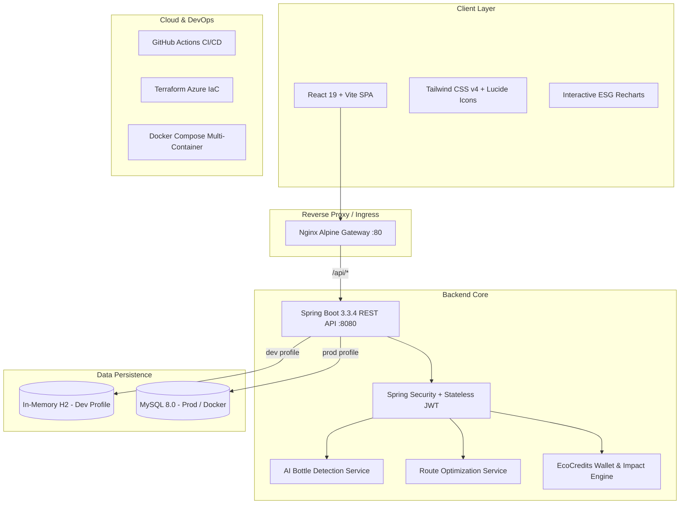

# 🌱 EcoLoop — Smart Reward-Based Recycling Platform

[](https://spring.io/projects/spring-boot)
[](https://react.dev/)
[](https://www.typescriptlang.org/)
[](https://tailwindcss.com/)
[](https://www.docker.com/)
[](https://www.terraform.io/)
[](LICENSE)

**EcoLoop** is an enterprise-grade, cloud-native full-stack recycling ecosystem designed to incentivize residential plastic bottle recycling through AI-assisted bottle estimation, doorstep collection logistics, algorithmic route optimization, verifiable environmental impact ledgers, and municipal reward redemptions.

---

## 🏛️ System Architecture



---

## ✨ Core Features & Role Capabilities

### 1. 👤 Citizen Resident Portal
- **AI-Assisted Bottle Estimation**: Upload or capture bottle batch photos for automated detection, confidence scoring, and estimated plastic weight.
- **Doorstep Pickup Scheduling**: Book preferred dates, time slots (`09:00 - 11:00 AM`, `02:00 - 04:00 PM`), and address coordinates.
- **EcoCredits Wallet**: Transparent ledger crediting **5 EcoCredits per verified bottle** directly into the resident's digital balance.
- **Rewards Marketplace**: Exchange credits for public transit passes (e.g. Metro Rail), utility bill rebates, and grocery vouchers with instant alphanumeric coupon code generation.
- **Environmental Footprint**: Track personal and municipal plastic weight diverted (kg), avoided $CO_2$ emissions, equivalent trees planted, and energy conserved ($kWh$).
- **Community Leaderboard**: Neighborhood podium (Gold, Silver, Bronze) celebrating top recycling contributors.

### 2. 🚛 Field Collector Portal
- **Operations Dashboard**: Real-time overview of assigned pickups, pending stops, and verified volumes.
- **Algorithmic Route Optimization**: Sequenced stop-by-stop navigation minimizing travel distance and urban carbon emissions.
- **Direct Navigation & Calling**: One-click Google Maps GPS links and direct phone dialing for resident coordination.
- **Audited Verification Modal**: Field weighing and physical count audit with automatic credit dispatch to the citizen.

### 3. 🏛️ Government & Platform Administrator Portal
- **Municipal Command Console**: High-level ESG telemetry, waste diversion rate, and active fleet statistics.
- **Citizen Management**: View resident directories, track activity, and manage authorization status.
- **Collector Onboarding**: Register verified field collection agents and allocate municipal wards.
- **Pickup Dispatch**: Reassign and dispatch collection orders dynamically across the fleet.
- **Catalog Management**: Curate government-backed and commercial partner reward vouchers.
- **ESG Audit Export**: Generate and download formatted CSV municipal sustainability reports.

---

## 🔐 Pre-Seeded Demo Accounts

The platform comes pre-seeded with sample data across all roles for immediate evaluation:

| Role | Email | Password | Pre-loaded Data |
|---|---|---|---|
| **Admin** | `admin@ecoloop.com` | `Admin@123` | Full platform analytics, user directory, catalog |
| **Collector** | `collector.rajesh@ecoloop.com` | `Collector@123` | Route waypoints, assigned pickups in Indiranagar |
| **Citizen** | `citizen.arun@gmail.com` | `Citizen@123` | Active pickups, 250 EcoCredits wallet, impact stats |

*(Note: Citizens can also self-register at `/register`)*.

---

## 🚀 Quick Start Guide

### Option A: Zero-Dependency Local Run (Recommended for Dev)

The backend features an embedded in-memory database profile (`dev`), meaning **no local MySQL installation is required** to run immediately.

#### 1. Start the Backend API:
```bash
cd backend
mvn spring-boot:run
```
*API will start on `http://localhost:8080/api`.*
*Swagger/Actuator health available at `http://localhost:8080/api/health`.*

#### 2. Start the Frontend Client:
```bash
cd frontend
npm install
npm run dev
```
*Web application will launch at `http://localhost:5173`.*

---

### Option B: Docker Compose (Production Multi-Container)

Run the complete stack (MySQL 8 + Spring Boot + React + Nginx) with a single command:

```bash
docker-compose up --build -d
```

- **Frontend Application**: `http://localhost`
- **Backend REST API**: `http://localhost:8080/api`
- **MySQL Database**: `localhost:3306`

To shut down:
```bash
docker-compose down -v
```

---

## 🛠️ Tech Stack & Engineering Highlights

| Layer | Technology | Key Highlights |
|---|---|---|
| **Backend** | Java 21 / 25, Spring Boot 3.3.4 | Pure standard POJOs, stateless JWT authentication, Bean Validation, Hibernate JPA |
| **Security** | Spring Security 6, JJWT | Role-based access control (`@PreAuthorize`), CORS filter, BCrypt password hashing |
| **Frontend** | React 19, Vite, TypeScript | Tailwind CSS v4, Lucide icons, Recharts interactive data visualization |
| **Database** | Dual-profile: H2 (dev) / MySQL 8 (prod) | Automated schema migration (`ddl-auto: update`), sample data seeding |
| **Containerization** | Multi-Stage Dockerfiles | Alpine-based minimal JRE runtime, non-root container users, Nginx reverse proxy |
| **CI/CD** | GitHub Actions | Automated Maven verification, TypeScript bundling, Docker build testing |
| **Cloud IaC** | HashiCorp Terraform | Azure Linux App Service, MySQL Flexible Server, Azure Key Vault, App Insights |

---

## 📡 REST API Reference

### Authentication (`/api/auth`)
- `POST /api/auth/register` — Citizen self-registration
- `POST /api/auth/login` — Stateless JWT generation

### Doorstep Pickups (`/api/pickups`)
- `GET /api/pickups` — List citizen's pickup requests
- `POST /api/pickups` — Schedule a new pickup request
- `GET /api/pickups/{id}` — Get detailed pickup status
- `PUT /api/pickups/{id}/cancel` — Cancel pending pickup

### AI Bottle Estimation (`/api/ai`)
- `POST /api/ai/bottle-estimate` — Multipart image upload for AI item & plastic volume estimation

### EcoCredits & Wallet (`/api/ecocredits`)
- `GET /api/ecocredits/wallet` — View current balance and totals
- `GET /api/ecocredits/transactions` — Audit ledger of earnings and deductions

### Rewards Marketplace (`/api/rewards`)
- `GET /api/rewards` — Browse active reward catalog
- `POST /api/rewards/{id}/redeem` — Claim voucher code using EcoCredits
- `GET /api/rewards/redemptions` — Citizen redemption history

### Collector Operations (`/api/collector`)
- `GET /api/collector/pickups` — Pickups assigned to logged-in collector
- `PUT /api/collector/pickups/{id}/status` — Update collection status (`COLLECTOR_ON_THE_WAY`)
- `POST /api/collector/pickups/{id}/verify` — Submit verified bottle count & weight
- `GET /api/collector/route` — AI-optimized sequential itinerary for today's run

### Municipal Admin & ESG (`/api/admin`)
- `GET /api/admin/statistics` — Citywide recycling metrics
- `GET /api/admin/citizens` — Citizen directory & status management
- `GET /api/admin/collectors` — Active collection fleet roster
- `POST /api/admin/collectors` — Onboard new field collector
- `GET /api/admin/pickups` — Global pickup logistics table
- `POST /api/admin/pickups/{id}/assign` — Assign collector to pickup
- `POST /api/admin/rewards` — Add new reward to public catalog
- `DELETE /api/admin/rewards/{id}` — Remove reward from catalog

---

## ☁️ Azure Cloud Infrastructure (Terraform)

The `terraform/` directory contains production-ready Infrastructure as Code targeting Microsoft Azure:

```bash
cd terraform
terraform init
terraform plan -var="db_admin_password=<SECURE_PW>" -var="jwt_secret_key=<JWT_SECRET>"
terraform apply
```

Resources created:
1. **Azure Resource Group** (`rg-ecoloop-prod`)
2. **Azure Database for MySQL Flexible Server** (`mysql-ecoloop-prod`)
3. **Azure Key Vault** (`kv-ecoloop-prod`) for zero-trust secret management
4. **Azure Linux App Service Plan & Web Apps** (`app-ecoloop-backend-prod`)
5. **Azure Static Web Apps** (`stapp-ecoloop-frontend-prod`)
6. **Application Insights & Log Analytics** for real-time telemetry

---

## 📄 License
This project is open-source under the [MIT License](LICENSE).
